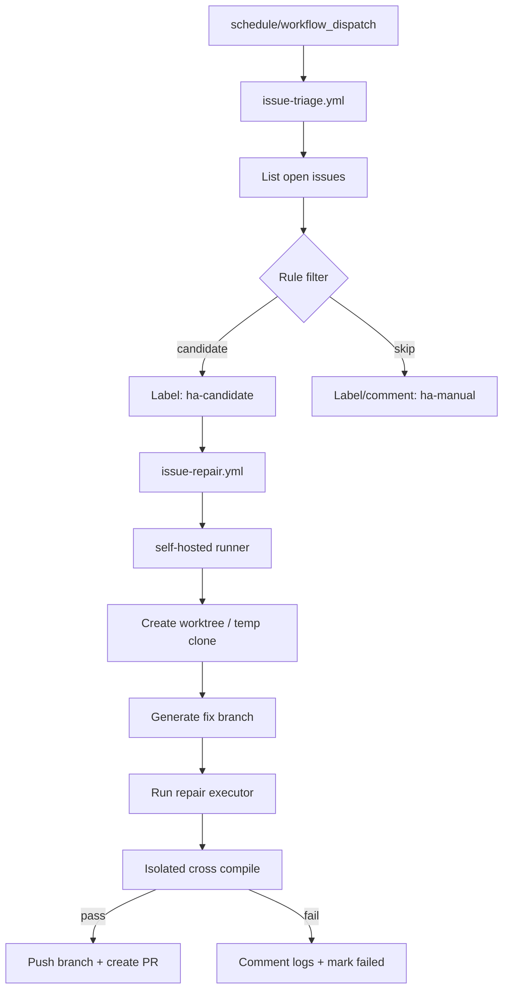

# 技术设计: GitHub Issue 自动巡检与修复工作流

## 技术方案

### 核心技术
- GitHub Actions `schedule` / `workflow_dispatch`
- GitHub `GITHUB_TOKEN` 或 GitHub App / 细粒度 PAT
- self-hosted runner
- GitHub REST API（Issues / Labels / Comments / Pull Requests）
- 本地隔离交叉编译命令

### 实现要点
- 把流程拆成 `issue-triage` 与 `issue-repair` 两段，避免“拉 issue”和“改代码”耦合在同一个超权工作流里
- 所有自动修复都以“新分支 + PR”收口，不允许直接推 `main/master`
- `issue-repair` 仅在 self-hosted runner 上运行，并使用独立工作目录/`git worktree`，不污染主工作区
- 候选 issue 需要满足白名单规则，例如 `bug/build/regression` 标签、模板完整、无敏感输入信号
- 修复结果必须经过交叉编译验证，优先执行已沉淀到知识库中的 RK830 隔离构建命令
- 自动修复器本体必须是可非交互执行的 CLI 或内部 API 服务，GitHub Actions 不能直接复用当前会话式代理环境

## 架构设计


## 架构决策 ADR
### ADR-20260312-02: 采用“两段式工作流 + PR 收口”而非单工作流直推
**上下文:** 自动巡检和自动修复对权限、执行环境和失败处理的要求完全不同。  
**决策:** 用 `issue-triage.yml` 做低权限筛选，用 `issue-repair.yml` 做高权限修复；修复结果统一走 PR，不直接推主分支。  
**理由:** 降低高权限运行频率，便于审计，并把自动化风险压缩到可回滚的 PR 边界。  
**替代方案:** 单一工作流直接拉 issue、改代码、推主分支 → 拒绝原因: 权限过大，失败面太宽，不利于人工兜底。  
**影响:** 工作流数量增加，但安全边界和可维护性显著改善。

### ADR-20260312-03: 修复任务强制使用 self-hosted runner
**上下文:** `rk_gb` 依赖本地 Rockchip 交叉编译工具链和已验证的隔离构建路径，Hosted Runner 难以原样复现。  
**决策:** triage 可在 GitHub Hosted Runner 或 self-hosted 上跑；repair 强制绑定专用 self-hosted runner 标签。  
**理由:** 只有 self-hosted runner 能稳定访问本地 RK 工具链、私有编译依赖和隔离构建命令。  
**替代方案:** 纯 Hosted Runner 方案 → 拒绝原因: 缺工具链、板级依赖不全，无法形成稳定验证闭环。  
**影响:** 需要单独维护 runner 生命周期、磁盘清理和安全隔离策略。

## API设计

### `GET /repos/{owner}/{repo}/issues`
- **用途:** 拉取 open issues 做候选筛选
- **字段:** `state=open`, `labels`, `sort`, `since`

### `POST /repos/{owner}/{repo}/issues/{issue_number}/comments`
- **用途:** 回写 triage 或 repair 结果

### `POST /repos/{owner}/{repo}/issues/{issue_number}/labels`
- **用途:** 增加 `ha-candidate` / `ha-manual` / `ha-failed` 等标签

### `POST /repos/{owner}/{repo}/pulls`
- **用途:** 为成功修复的分支创建 PR

## 数据模型
```json
{
  "issue_candidate": {
    "number": 123,
    "title": "build fails on rk830",
    "labels": ["bug", "build"],
    "risk_level": "low",
    "auto_fixable": true,
    "skip_reason": ""
  },
  "repair_result": {
    "branch": "ha/issue-123-build-fix",
    "compile_passed": true,
    "pr_number": 45,
    "runner_label": "rk830-builder"
  }
}
```

## 安全与性能
- **安全:** 不使用账号密码；不把真实 token 写入仓库；工作流显式声明最小权限；禁止把 `github.event.issue.body` 直接拼接进 shell
- **安全:** self-hosted runner 仅用于受控仓库；修复流程只处理白名单 issue；工作区执行完成后做清理
- **安全:** 默认关闭“自动批准 PR”，仅保留“自动创建 PR”能力
- **性能:** `schedule` 避开整点高峰；triage 做增量扫描；repair 对单个 issue 串行执行，避免 runner 竞争工具链目录

## 测试与部署
- **测试:** 先在 `workflow_dispatch` 模式下，用模拟 issue 编号和只读 dry-run 验证 triage 与 repair 逻辑
- **测试:** repair 阶段至少验证 “分支创建 -> 修复执行 -> RK830 交叉编译 -> PR 创建” 链路
- **部署:** 先部署 triage，再部署 repair；repair 初期仅对白名单标签启用

## 官方约束参考
- GitHub `schedule` 事件在高负载时可能延迟，且建议避开整点
- `GITHUB_TOKEN` 是仓库级 GitHub App 安装令牌，权限受工作流配置和仓库设置限制
- GitHub 仓库默认可能不允许 Actions 创建/批准 PR，需要在仓库 Actions 设置中显式开启“允许创建/批准 PR”
- self-hosted runner 不保证每次都处于干净瞬时环境，运行不可信输入时必须加强隔离
