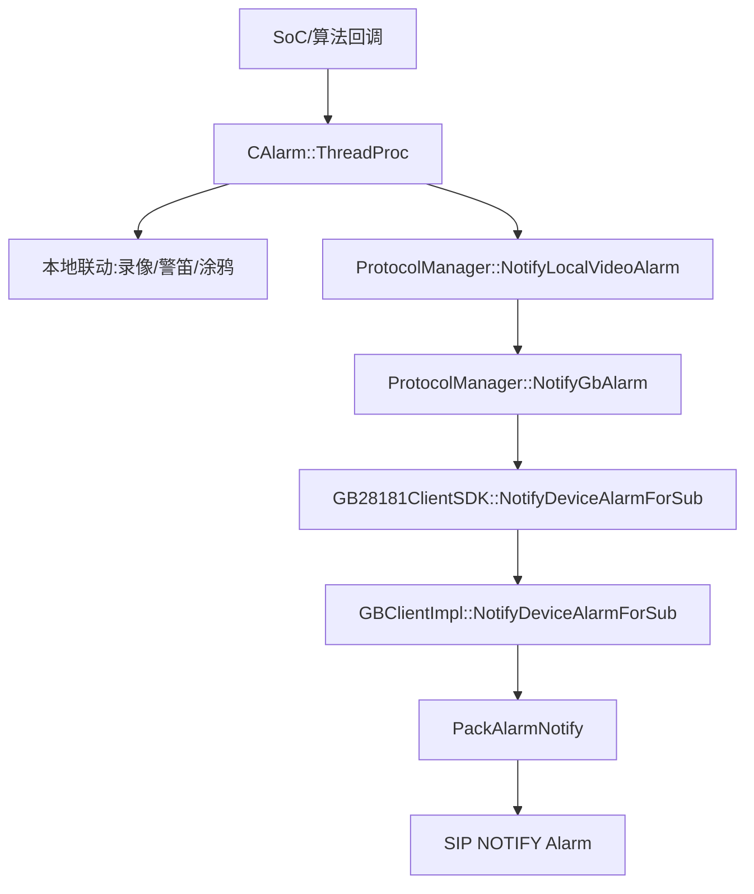

# 技术设计: GB28181报警上报链路补齐

## 技术方案

### 核心技术
- C++ App 侧本地报警线程
- `ProtocolManager` GB28181 控制面封装
- GB28181 SDK 报警订阅/通知/复位
- XML `Alarm` 报文编码

### 实现要点
- 在 `CAlarm::ThreadProc` 内只在报警状态发生边沿变化时触发 GB28181 上报，避免 50ms 轮询造成重复风暴。
- App 层通过 `CSofia::instance()->GetProtocolManager()` 获取协议管理器，避免引入新的全局状态。
- 本地 `motion/human/vehicle/non_vehicle` 统一映射到 GB 视频报警 `kGB_ALARM_TYPE_VIDEO_MOTION`，并通过 `AlarmTypeParam` 与 `AlarmDescription` 承载细分类型。
- `ProtocolManager` 增加轻量的本地报警状态缓存与复位接口，用于去重和 `ResetAlarm` 收敛。
- SDK 侧修正报警订阅删除时使用错误指针的问题，保证旧 timer 能被正确移除。

## 架构决策 ADR

### ADR-20260323-03: 先补最小可用报警闭环，不一次性扩展全部白皮书告警
**上下文:** 当前阻塞点是“真实报警事件完全未上报国标平台”，而不是白皮书扩展告警码未全量覆盖。
**决策:** 第一阶段只打通现有本地视频报警到 GB28181 `Alarm` 的闭环，优先覆盖移动/人形/车形/非机动车这类已存在的 SoC 事件。
**理由:** 这样可以先恢复联调能力，验证平台订阅、通知和复位主链；后续如需补掉电、升级失败等扩展设备告警，再在这个基础上扩展。
**替代方案:** 一次性把白皮书扩展设备告警码和全部真实事件源全部补齐。
**拒绝原因:** 事件源分散、平台口径未完全锁定，风险和改动面都更大。
**影响:** 第一阶段国标报警类型主要覆盖视频类报警，设备类扩展告警另行补充。

### ADR-20260323-04: 细分类型放入 `AlarmTypeParam`，标准类型统一落到 `VideoMotion`
**上下文:** 本地报警位图是 `motion/human/car/non_vehicle`，而 GB28181 标准视频报警类型是枚举语义，不适合直接把本地位图值塞入 `AlarmType`。
**决策:** `AlarmType` 固定为 `kGB_ALARM_TYPE_VIDEO_MOTION`，`AlarmTypeParam` 填 `motion/human/vehicle/non_vehicle`，`AlarmDescription` 输出可读描述。
**理由:** 平台至少能按标准类型识别为“视频移动报警”，同时保留设备本地细分语义。
**替代方案:** 直接把 `human/vehicle` 编成自定义扩展码写进 `AlarmType`。
**拒绝原因:** 当前仓库和知识库都没有锁定统一扩展编码口径，贸然扩展会让平台兼容性更差。
**影响:** 平台若只识别标准字段，仍可收到基础视频报警；若解析扩展字段，可进一步区分细分类型。

## 架构设计


## 数据模型
```text
AlarmNotifyInfo:
  AlarmID
  DeviceID
  AlarmPriority
  AlarmMethod
  AlarmType
  AlarmState
  AlarmTime
  AlarmDescription
  AlarmTypeParam
  ExtendInfo
  Longitude
  Latitude

ProtocolManager local alarm state:
  active(bool)
  type_bits(int)
  last_param(string)
```

## 安全与性能
- **安全:** 仅在状态变化时上报，避免异常情况下短时间大量发送 `NOTIFY Alarm`。
- **安全:** 报文描述字段只写固定文本，不拼接外部输入，避免脏数据进入 SIP/XML。
- **性能:** 复用现有 `NotifyGbAlarm` 的“无订阅快速返回”逻辑；无订阅时不会新增明显负担。

## 测试与部署
- **测试:** 编译 `rk_gb/App`，确保 `Alarm.cpp`、`ProtocolManager.cpp`、SDK/XML 链路都通过。
- **测试:** 通过日志验证报警开始/结束时分别只发送一次国标报警通知。
- **测试:** 平台订阅后触发本地移动报警，观察 `NOTIFY Alarm` 中 `AlarmState` 和 `AlarmTypeParam`。
- **测试:** 平台执行 `ResetAlarm` 后，验证本地录像标志和 GB 报警状态都被清理。
