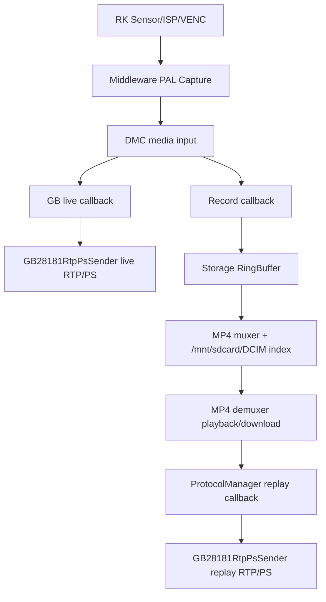

# RK 媒体链路

## 目的
沉淀当前 RK IPC 工程从 PAL Capture、DMC 分发、编码配置、实时流、录像存储到 GB28181 回放/下载的媒体链路，避免协议联调时只盯 SIP/SDP 而忽略设备侧编码与存储事实。

## 模块概述
- **职责:** 说明视频/音频数据如何从 RK 媒体抽象层进入实时预览、录像、回放和协议发送
- **状态:** ✅稳定
- **最后更新:** 2026-05-16
- **代码真实来源:** `Middleware/Include/PAL/Capture.h`、`Middleware/Include/PAL/libdmc.h`、`App/Media/*`、`App/Storage/*`、`App/Protocol/ProtocolManager.cpp`

## 规范

### 需求: 明确媒体数据流向
**模块:** RKMediaPipeline
媒体数据以 PAL Capture 为设备侧入口，以 DMC 回调为订阅分发模型。实时流、录像、GB 回放/下载不是独立编码管线，而是共享同一套编码配置、DMC 媒体类型和存储帧元数据。

#### 场景: 实时预览联调
前置条件:
- 平台通过 GB28181 `INVITE` 请求实时流
- SDP 可能携带 `f=` 指定视频编码、帧率、码率等参数
- 预期结果1: 协议层按目标主/辅码流生成 `VideoEncodeStreamConfig`
- 预期结果2: 媒体层先比较 `CFG_VIDEO` 当前值，不一致时一次性写回多个参数
- 预期结果3: DMC 通过 `CaptureSetStreamCallBack` 向 GB live 回调推送 H264/H265/AUDIO 数据

#### 场景: 录像回放/下载联调
前置条件:
- SD 卡已有 H264/H265 混合录像
- 平台请求某个时间段回放或下载
- 预期结果1: 先从录像索引匹配实际 MP4 文件，再用 demuxer 探测视频 codec
- 预期结果2: `200 OK` SDP 与后续 PS 封装使用录像文件真实 codec
- 预期结果3: 每帧发送时继续使用 `Mp4DemuxerFrameInfo_s::iCodeType` 选择 H264/H265，不能只相信平台请求或会话缓存

## 总体链路

## PAL Capture 与 DMC

| 能力 | API/定义 | 说明 |
|------|----------|------|
| 媒体初始化 | `AvInit(float sd, int ispmode)` | 正常启动时最先拉起 RK 媒体基础能力 |
| 编码初始化 | `CaptureInitEncParam(channel, enc_type, bit_rate, frmae_rate, gop)` | `VideoParamInit()` 从 `CFG_VIDEO` 读取后逐通道初始化 |
| 编码变更 | `CaptureChangeEncParam(channel, enc_type, bit_rate, frmae_rate, gop)` | `CFG_VIDEO` 变化后由 `AVManager::onConfigVideo()` 统一触发 |
| 码流订阅 | `CaptureSetStreamCallBack(module_name, media_type, proc)` | 对上封装 DMC 订阅，`module_name` 必须区分业务 |
| 分辨率查询 | `CaptureGetResolution(stream_id, &width, &height)` | 编码状态、OSD 画布、协议回包都会依赖 |
| 强制 I 帧 | `CaptureForceIFrame` | 实时流和编码切换后的关键排查点 |

`libdmc.h` 中主码流为 `DMC_MEDIA_VIDEO_MAIN_STREAM`，子码流为 `DMC_MEDIA_VIDEO_SUB_STREAM`；媒体类型用 `DMC_MEDIA_TYPE_H264`、`DMC_MEDIA_TYPE_H265`、`DMC_MEDIA_TYPE_AUDIO` 区分；视频帧类型用 `DMC_MEDIA_SUBTYPE_IFRAME/PFRAME/BFRAME` 标记。

## 编码配置链路

| 项 | 当前实现 |
|----|----------|
| 配置模型 | `VideoConf_S::chan[2]`，字段为 `enc_type/bit_rate/frmae_rate/gop` |
| 编码枚举 | `enc_type=0` 表示 H264，`enc_type=1` 表示 H265 |
| 默认值 | `CMediaDefaultConfig::setVideo()` 默认两个通道均为 H265，主码流 2048 kbps，子码流 1024 kbps，15 fps，GOP 50 |
| 启动应用 | `AVManager::VideoParamInit()` 读取 `CFG_VIDEO` 并调用 `CaptureInitEncParam()` |
| 动态应用 | `AVManager::onConfigVideo()` 比较整通道配置，有差异时调用 `CaptureChangeEncParam()` |
| 协议桥接 | `VideoEncodeControl` 的 `rk_video_get/set_*` 实际读写 `CFG_VIDEO`，不是直接访问 RK SDK |
| 批量写回 | `ApplyCfgVideoEncodeStreamConfig()` 会一次读取当前 `CFG_VIDEO`，只修改有差异的 codec/fps/bitrate，再一次 `setConfig(..., applyOK)` |
| 暂未真实应用 | `rk_video_set_RC_mode()` 与 `rk_video_set_resolution()` 当前基本是兼容桩，协议层会记录日志但不应假设底层已改变码率控制模式或分辨率 |

## 实时流链路

| 阶段 | 落点 |
|------|------|
| 协议入口 | `ProtocolManager` 处理 GB28181 live `INVITE` |
| 编码协商 | `MaybeApplyGbLiveMediaFVideoConfig()` / `ApplyVideoEncodeStreamConfig()` |
| DMC 订阅 | `StartGbLiveCapture()` 使用 `CaptureSetStreamCallBack(kGbLiveDmcModuleName, H264|H265|AUDIO, OnGbLiveCapture)` |
| 帧处理 | `HandleGbLiveCaptureInternal()` |
| 发送 | `GB28181RtpPsSender` 负责 PS/RTP 封装和网络发送 |

实时流失败不能只看 SIP 返回码。若日志里已看到 `f=` 解析成功但没有出流，要继续确认编码参数应用返回值、DMC 订阅是否成功、首个 I 帧是否到达、TCP/UDP 发送侧是否被回压或断开。

## 录像链路

| 阶段 | 落点 |
|------|------|
| 录像启动 | `CRecordManager::Start()` 挂 `CFG_RECORD`，调用 `g_AVManager.VideoInit()` 并订阅 `H264|H265|AUDIO` |
| 视频入库 | `onRecord_fn()` 只写主视频流，`iStreamType=1`，I/P 帧写入 `iFrameType` |
| 编码标记 | `onRecord_fn()` 中 `DMC_MEDIA_TYPE_H264 -> iCodeType=1`，`DMC_MEDIA_TYPE_H265 -> iCodeType=2` |
| 音频入库 | 当前写第二音频流，`iStreamType=2`，受 `bMuteRecord` 控制 |
| 环形缓冲 | `CStorageManager::WriteFrameData()` 写入 `m_avStreamRingBuffer` |
| MP4 封装 | `InitMp4Muxer()` 按 `video_codec_type=1` 选择 `AV_CODEC_ID_H264`，其他选择 `AV_CODEC_ID_H265` |
| 文件索引 | 录像位于 `/mnt/sdcard/DCIM/YYYY/MM/DD/`，索引文件用于搜索回放时间段 |

录像编码格式的可信链路是 `DMC media_type -> stream_data_header_S::iCodeType -> MP4 muxer codec -> MP4 demuxer iCodeType`。排查混合 H264/H265 录像时，优先沿这条链路查，不要只看当前实时编码配置。

## 回放/下载链路

| 阶段 | 落点 |
|------|------|
| 录像搜索 | `CollectGbRecordEntries()` / `Storage_Module_SearchRecord*` |
| codec 探测 | `ResolveGbReplayFileVideoCodec()` 先按文件名中的 `h264/h265/hevc/avc` 判断；文件名没有明确 codec 时，再打开 MP4 读取 moov/stream info |
| 建链应答 | `RespondGbMediaPlayInfo()` 使用探测到的 codec 改写 SDP |
| 启动存储线程 | `Storage_Module_StartPlayback()` 或 `Storage_Module_StartDownload()` |
| 帧回调 | `ProtocolManager::OnGbReplayStorageFrame()` |
| 播放门控 | `HandleGbReplayStorageFrame()` 在 PLAY/ACK 前 gate 住帧 |
| 发送 codec | `SendVideoFrameByCodecType(..., frameInfo->iCodeType)` 按每帧 codec 封装 |
| 结束通知 | `StorageManager::PlaybackProc()` 在单个录像文件读到 EOF 后回调 `PlaybackProc(NULL, 0, NULL, pParam)`，协议层转换为 `MediaStatus 121/eos` |

最近 H264/H265 混合回放问题的关键经验是：建链阶段要按录像文件实际 codec 回 SDP，发送阶段仍要逐帧按 demuxer 的 `iCodeType` 封装，避免 H264 录像沿用平台请求的 H265 或上一次会话状态。
当前 RK 录像文件名通常带 `_H264_` / `_H265_`，因此回放 codec 探测应优先信任文件名，避免为了读 moov 打开边界文件造成慢探测或边界误判；只有老文件名不带 codec 标记时才回退到 `CMp4Demuxer::GetVideoCodecType()`。
如果回放区间跨越 H264/H265 文件边界，`ResolveGbReplayFileVideoCodec()` 只会按首个真正参与播放的文件回填 `200 OK`，这时平台客户端是否能播，取决于它能不能接受同一会话里后续文件切 codec。
工程处理原则应保持一个 GB 回放 RTP/PS 会话内的视频编码稳定：当前实现按“一个录像文件结束即一个回放会话结束”处理，文件 EOF 时主动发 `MediaStatus 121/eos`，避免同一会话静默跨文件切换 H264/H265；平台如需继续播放后续文件，应重新发起下一段回放。

## OSD 与图像翻转

| 能力 | 配置来源 | 应用路径 |
|------|----------|----------|
| 时间 OSD | `CFG_OSD_TIME` | `AVManager::VideoParamInit()` / `onConfigOSDTime()` 调 `gb_rkipc_osd_time_set()` |
| 文本 OSD | `CFG_OSD_TEXT` | `AVManager::VideoParamInit()` / `onConfigOSDText()` 调 `gb_rkipc_osd_text_set()` |
| GB OSD 协议态 | `VideoOsdControl` 缓存多文本、日期格式、时间格式等协议字段 | 当前设备侧主要落第一条文本和时间 OSD |
| 翻转 | `CFG_CAMERA_PARAM -> CameraParamAll.vCameraParamAll[0].mirror/flip` | `VideoImageControl::ApplyVideoImageFlipMode()` 写配置并触发 `applyOK` |

## 注意事项

- `VideoConf_S` 字段名是历史拼写 `frmae_rate`，不要在文档或代码审查中误改成 `frame_rate` 后破坏配置交换。
- `VideoFormat=2 = H.264` 属于 GB28181/白皮书协议字段映射，不等于设备内部 `VideoConf_S::enc_type=1`。内部 `enc_type=1` 是 H265。
- 录像回放排查应优先看 MP4 文件实际 codec 与 demuxer `iCodeType`，当前实时预览 codec 只能作为参考。
- DMC `media_chn` 与 `media_type` 是两个维度：主/子码流由 `media_chn` 表示，H264/H265/AUDIO 由 `media_type` 表示。
- 协议层新增媒体控制时，应遵守 `query -> compare -> apply`，尽量一次配置写回多个字段，避免连续重配编码器。

## 依赖
- `Middleware/Include/PAL/Capture.h`
- `Middleware/Include/PAL/libdmc.h`
- `App/Media/AVManager.cpp`
- `App/Media/VideoEncodeControl.cpp`
- `App/Media/VideoOsdControl.cpp`
- `App/Media/VideoImageControl.cpp`
- `App/Media/Record.cpp`
- `App/Storage/common/StorageManager.cpp`
- `App/Storage/common/Mp4_Demuxer.*`
- `App/Protocol/ProtocolManager.cpp`
- `App/Protocol/gb28181/GB28181RtpPsSender.*`

## 变更历史
- 2026-05-16: 补充 GB 回放单文件 EOF 主动 EOS 口径，明确 Storage NULL 回调到 `MediaStatus 121/eos` 的链路。
- 2026-05-16: 新增 RK 媒体链路知识库，沉淀 PAL/DMC、编码配置、实时流、录像、回放/下载和 OSD/翻转边界。
