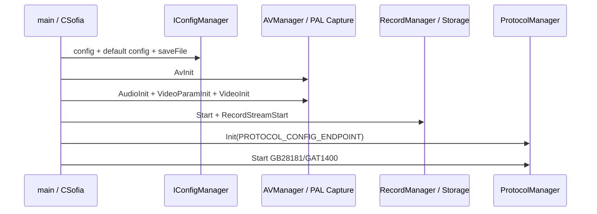

# RK SoC IPC 平台基线

## 目的
沉淀当前 RK SoC IPC 工程的平台身份、板型配置、构建入口、SDK 边界和运行启动顺序，作为后续协议、媒体、存储问题排查的基础索引。

## 模块概述
- **职责:** 说明 RV1106/RV1103 系列 IPC 工程的工具链、板型宏、第三方库和应用分层
- **状态:** ✅稳定
- **最后更新:** 2026-05-16
- **代码真实来源:** `CMakeLists.txt`、`Middleware/CMakeLists.txt`、`envsetup.sh`、`build.sh`、`App/CMakeLists.txt`、`App/Main.cpp`

## 规范

### 需求: 明确 RK IPC 平台身份
**模块:** RKSoCIpcPlatform
本项目是 Linux 用户态 IPC 应用，目标芯片以 `RV1106_DUAL_IPC` 为主，交叉编译工具链为 `arm-rockchip830-linux-uclibcgnueabihf-*`，媒体能力主要通过 Middleware PAL 与 RK MPP/Rockit/RKAIQ 等库承接。

#### 场景: 新人接手工程
前置条件:
- 需要判断当前仓库是协议工程、业务应用还是工具链包
- 需要确认板型、传感器、Wi-Fi/BLE 组合和可执行文件入口
- 预期结果1: 主业务代码在 `App/`、`Middleware/`、`third_party/`，不是 `RK/` 工具链目录
- 预期结果2: 主程序为 `dgiot`，由根 `CMakeLists.txt` 添加 `Package` 和 `App`
- 预期结果3: 默认构建口径是 `RV1106_DUAL_IPC + RC0240 + ATBM6062 + release`

#### 场景: 板型切换与打包
前置条件:
- 使用 `build.sh` 的交互式板型菜单或手工传入 CMake 宏
- 需要定位某个板型使用的存储实现、BLE/Wi-Fi 库和打包目录
- 预期结果1: `RC0240/RC0240V20/RC0240V30/RC0240V40` 使用 `App/Storage/common`
- 预期结果2: `RC0240_LGV10` 使用 `App/Storage/lg`
- 预期结果3: `build.sh image` 按 `packaging-$BOARD_TYPE` 选择打包目录

## 平台事实

| 维度 | 当前事实 | 代码证据 |
|------|----------|----------|
| 工程名 | `dgiot` | `CMakeLists.txt` |
| 目标系统 | Linux | `CMakeLists.txt` / `Middleware/CMakeLists.txt` |
| 交叉编译器 | `arm-rockchip830-linux-uclibcgnueabihf-gcc/g++` | `CMakeLists.txt` / `envsetup.sh` |
| 默认芯片 | `RV1106_DUAL_IPC` | `build.sh` |
| 默认板型 | `RC0240` | `build.sh` |
| 默认无线 | `ATBM6062` | `build.sh` |
| 默认模式 | `release` | `build.sh` |
| 输出程序 | `Bin/dgiot` | `App/CMakeLists.txt` |
| 当前注意项 | 顶层和 Middleware CMake 当前代码仍写 `add_definitions(-o3)`，构建前需按实际分支确认是否应修正为 `-O3` | `CMakeLists.txt` / `Middleware/CMakeLists.txt` |

## 板型与宏

| 板型 | 无线/BLE | 传感器线索 | 存储实现 | 说明 |
|------|----------|------------|----------|------|
| `RC0240` | `ATBM6062` / `rtl8818ftv` | `gc2063` | `Storage/common` | `build.sh` 默认双目枪 |
| `RC0240V20` | `ATBM6062` | `cv2003` | `Storage/common` | 菜单第 4 项 |
| `RC0240V30` | `AIC8800DL` | `gc2063` | `Storage/common` | 菜单第 2 项 |
| `RC0240V40` | `ATBM6132` | `gc2063` | `Storage/common` | 菜单第 3 项 |
| `RC0240_LGV10` | `ATBM6012B` 线索 | 未在菜单默认启用 | `Storage/lg` | 励国安保灯分支线索 |

## SDK 与库边界

| 层级 | 目录/库 | 职责 |
|------|---------|------|
| PAL/Middleware | `Middleware/Include/PAL/*`、`Middleware/Lib/libmpp.a` | 对上提供 `Capture`、`Audio`、DMC 等抽象 |
| RK 多媒体库 | `rockit_full`、`rockchip_mpp`、`rkaiq`、`rkmuxer`、`rga`、`rockiva`、`rknnmrt`、`rksysutils`、`drm` | 编码、ISP、RGA、AI/IVA、muxer 和系统能力 |
| 协议移植层 | `third_party/platform_sdk_port`、`third_party/gb_sip/install` | GB28181/SIP/GAT1400 旧 SDK 移植与裁剪 |
| RTP/PS | `third_party/media-server/libmpeg`、`third_party/media-server/librtp` | GB28181 PS 封装和 RTP 发送 |
| 应用桥接 | `App/Media/*`、`App/Protocol/*` | 把配置、媒体、存储、协议会话串起来 |

## 启动主链

正常启动路径的关键顺序是 `AvInit -> AudioInit -> VideoParamInit -> VideoInit -> Camera/Alarm/Record -> ProtocolManager::Init/Start`。其中 `VideoParamInit()` 很关键：注释明确说明如果不调用，帧率、码率等参数会走 `/oem/usr/bin/rkipc.ini`，调用后才以 `CFG_VIDEO` 为准。

## 实现要点

- `envsetup.sh` 只设置 `PATH`、`PLATFORM=RV` 和 `CROSS=arm-rockchip830-linux-uclibcgnueabihf-`，不是完整构建脚本。
- `build.sh` 会固定使用源码树内 `cmake-build` 与 `Middleware/cmake-build`，适合本工程传统构建，不适合需要完全隔离的多 SoC 并行构建。
- `App/CMakeLists.txt` 同时承载业务源文件清单、板型存储实现选择、BLE/Wi-Fi 库选择和协议 SDK 静态库构建。
- 协议层不应直接假设 RK SDK 行为；涉及编码、OSD、图像翻转时优先通过 `App/Media/VideoEncodeControl.*`、`VideoOsdControl.*`、`VideoImageControl.*` 这类桥接层。
- 存储层有 `common` 与 `lg` 两套实现，GB 回放/下载问题要先确认当前板型实际编入的是哪套 `Storage_api.cpp` / `StorageManager.cpp`。

## 排查入口

| 问题 | 优先看 |
|------|--------|
| 构建工具链/板型不对 | `envsetup.sh`、`build.sh`、根 `CMakeLists.txt`、`App/CMakeLists.txt` |
| 视频编码参数不生效 | `App/Main.cpp` 正常启动顺序、`App/Media/AVManager.cpp`、`App/Media/VideoEncodeControl.cpp` |
| GB 实时流没帧 | `App/Protocol/ProtocolManager.cpp` 的 live capture 回调、`Middleware/Include/PAL/libdmc.h` |
| 录像回放/下载编码错 | `App/Media/Record.cpp`、`App/Storage/<board>/StorageManager.cpp`、`Mp4_Demuxer.*`、`GB28181RtpPsSender.*` |
| OSD/翻转不生效 | `VideoOsdControl.cpp`、`VideoImageControl.cpp`、`CFG_OSD_*`、`CFG_CAMERA_PARAM` |

## 依赖
- `CMakeLists.txt`
- `Middleware/CMakeLists.txt`
- `envsetup.sh`
- `build.sh`
- `App/CMakeLists.txt`
- `App/Main.cpp`
- `Middleware/Include/PAL/Capture.h`
- `Middleware/Include/PAL/libdmc.h`

## 变更历史
- 2026-05-16: 新增 RK SoC IPC 平台基线，补齐板型、工具链、SDK 边界、启动顺序和当前 `-o3` 构建注意项。
